# 前端学习笔记

## 参考

> [MDN Web](https://developer.mozilla.org/zh-CN/)

## week-1

## day-1 181220

## study url
- draft : 分析
- toggle : 切换
- horizontal : 垂直
- vertical : 水平
- https://github.com/mdn/learning-area.git
- https://developer.mozilla.org/zh-CN/docs/Learn/CSS/Introduction_to_CSS/Box_model

##  06 热气球

- 撑开 html 高度 
```
height : 100%;
```
- div 没有 width 属性 img 有
-  垂直 水平
```
background-size : 100% 100%;
```
- 动画帧 @keyframes
- ainimation：\<function : foo> \<direction : linear> \<state : 1s> \<count : infinite>

- 外边距塌陷

## 07 魔方球

- line-height = body size
- :nth-child(num)
- transform-style: preserve-3d 为子集元素保留 3d
- rotate 公共坐标系 translate 独立坐标系
- toggleClass add class name
- @keyframes no :
- jqury 对象和原生方法不可以互用
- jqury 获取的对象为数组，要写索引 arr[0]

## day-2 1821201

## study url

- CSS 工作原理

- CSS有着相当不错的错误修复系统
- 如果使用了未知 CSS 属性，或者给属性赋予了无效值，该声明会被视为无效，浏览器的 CSS 引擎会完全忽略它。
- CSS是由两块内容组合而成的：
	- 属性（Property）：一些人类可理解的标识符，这些标识符指出你想修改哪一些样式，例如：字体，宽度，背景颜色等。
	- 属性值（Value）：每个指定的属性都需要给定一个值，这个值表示你想把那些样式特征修改成什么样，例如，你想把字体，宽度或背景颜色改成什么。
- CSS 声明块

- [CSS 关键字索引](https://developer.mozilla.org/zh-CN/docs/Web/CSS/Reference)

## 07 魔方球

- $(this).css('propery')    获取 css 属性的值
- $(this).css('propery', 'value')   修改改属性的值
    - $(this).css('ainimationPlayState', 'paused | running')   动画时间点禁止

## 08 乐视 tab 栏

- emmet 语法
```
div>ul>(li>img)*9
div>ul>li*6>img
<div>
	<ul>
		<li></li>
		<li></li>
		<li></li>
		<li></li>
		<li></li>
		<li></li>
		<li></li>
		<li></li>
		<li></li>
	</ul>
</div>

div>ul>(li+img)*9
div>ul>li
<div>
	<ul>
		<li></li>
		
		<li></li>
		
		<li></li>
		
		<li></li>
		
		<li></li>
		
		<li></li>
		
		<li></li>
		
		<li></li>
		
		<li></li>
		
	</ul>
</div>
```
- 不显示元素
```
display : none;
```
- border 占位
- 透明颜色 rgba
- border-radius : 10px;  圆角 radius 半径
- 不给高度给行高默认居中
- 同级删除类
``` 
$(this).addClass("add").siblings('li').removeClass('add');
```
- 移入该表鼠标图标
```
cursor: pointer;
```

## 09 360 皮肤

- border-left: 2px solid transparent
- $(this).index() jqury 对象索引值
- eq()	通过索引值过滤
- 定时器
```
setInterval(function(){}, 1000);
```
- 设置定时器时先清除
```
let timer;
clearInterval(timer);
timer = setInterval(function(){}, 1000);
```
- hover(func(), func()) 复合函数包括： mouseenter and mouseleave
- 不论鼠标指针穿过被选元素或其子元素，都会触发 mouseover 事件。
- 只有在鼠标指针穿过被选元素时，才会触发 mouseenter 事件
- jquery 获取的 dom 没有 val()
```
Object.eq().val();
Object[num].value;
```
- dom 对象和 jquery 对象
```
<a class="a"></a>
<a class="a"></a>
<a class="a"></a>
```
	- $('.a')  // 选择了3个a，都是jq对象（可以用jq的属性、方法）
	$('.a').eq(1) // 选择了第二个a，是jq对象（不可以使用dom属性方法，可以用jq的属性、方法）
	- $('.a')[1]  // 选择了第二个a，是dom对象（可以使用dom属性，方法，不可以使用jq属性方法）
	- $('.a').eq(1)[0]  // 选择了第二个a，并且转化成都是dom对象（可以使用dom属性，方法，不可以使用jq属性方法）
	- $('.a')[0].eq(1) // 错误，因为dom对象用不了jq方法，eq（）是jq方法。
- 背景图片
```
html {
	height: 100%;
}
body {
	background-image: url('');
	background-size: 100% 100%;
}
```
- 元素叠加用定位
- img 转化为块元素没有 border
```
img {
	display : block;
}
```
- 清除浮动找父级 
```
overflow : hidden;
```
- 下拉巨幕
```
$('.open').click(function(event) {
	$('div').slideDown(500);
	$(this).hide();
});
$('.close').click(function(event) {
	$('div').slideUp(500);
	$('.open').show();
});
```
- 修改 css 
```
css('border-color', 'red')
```
## week-2
## day-1
- 文本类标签不嵌套
- 常见标准属性：id title style class
- div 没有元素撑开记得写宽高
- html5 文档声明 : \<!DOCTYPE HTML>
- html4 快捷键 ：html + xt + tab
- \<body> 可见页面内容 \</body>
- h1 1次 h2 两次
- 物理字体 ：b i u 粗 斜 下
- \<hr> 水平线
- \<a href="" target="">
- 字符实体 \&nbsp;
- \&copy;    版权符号
- ul ol
- 列表项父级最好为 ul | ol
- 1 l
- 定义列表：常用图文混排
```html
<dl>
	<dt>定义标题 decare title</dt>
	<dd>定义描述 decare description </dd>
<dl>
```
- css 样式表： 内联 > (嵌入 外联) <- 加载顺序
-  important > 内敛选择 > id 选择 > 类选择 > 关联选择 > 普通选择
- css !important 最高级
- font-weight : 100 200 300 ... 900;
- text-align : justify; 两边对齐
- 用 css 画三角形
```css
 p {
    width: 0px;
    height: 0px;
    margin: 100px;
    border: 50px solid transparent;
    border-bottom-color: black;
}
```
- background-repeat : no-repeat;
- background-position 
- 简写属性不试图强制它们替代属性的值的特定顺序。这适用于当这些属性使用不同类型的值时，因为这个时候顺序并不重要。但当几个属性可以设置相同值的时候，就没那么简单了。处理这些情况分以下几种类型：
	- 处理和盒子（box）边界（edge）相关的属性时，比如 border-style、margin 或者 padding， 始终使用一致的1个到4个值的语法表示这些边界：
	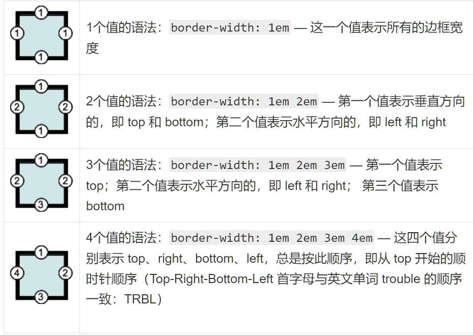
	- 同样，在处理和盒子的角相关的属性时，比如 border-radius，也始终使用一致的 1个到4个值的语法表示：
	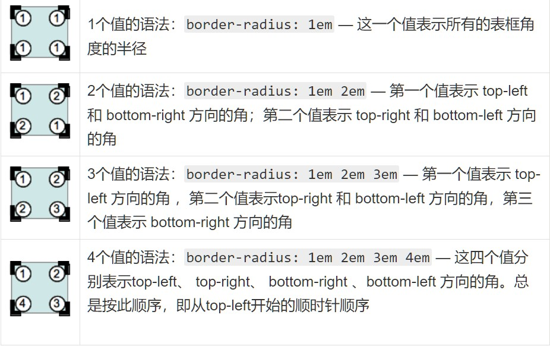
- background 有以下属性：
```css
background-color: #000;
background-image: url(imgs/bg.gif);
background-repeat: no-repeat;
background-position: top right;
```
- 可以简写成一行声明：
```css
background: #000 url(imgs/bg.gif) no-repeat top right;
```
- Font 下面的声明：
```css
font-style: italic;
font-weight: bold;
font-size: .8em;
line-height: 1.2;
font-family: Arial, sans-serif;
```
- 可以简写成下面的：
```css
font: italic bold .8em/1.2 Arial, sans-serif;
```
## day-2
- 块元素 ：前后有换行符 独占一行 垂直 div 
	- 宽度 ：父级 100%
	- 高度 ：内容决定
	- margin padding
- 内联元素 ：前后没有换行符 不会独占 水平 span 不支持宽高
	- margin padding 控制左右移动
	- background-color 为整个 盒模型
- 内联元素与块元素的相互转换
```css
display: block;	块状布局
		inline; 内联布局
		inline-block; 行内块元素
		none;
		/* 一般情况不转换 */
```
- 文字居中
	- 单行 水平 text-align : center;    垂直 line-height = father box height

	- 多行  水平 p {width margin : auto auto}    垂直 定位
- 浮动
	- 元素浮动之后变成行内块元素
	- 子级元素浮动后不占位
	- 父级无法检测到子级的高度（浮动塌陷）
		- 解决方案：
			- 给父级添加 overflow : hidden;
			- 在同级添加 \<p style="<pclear:both">\</p> (没有浮动的元素，块元素)
			- 浮动父级 （不建议）
			- 直接给父级元素高度
- 
```css
a {
	text-decoration : none;
	color: #333;
}
```
- 
```html
\<a href="#"> \</a>
```
- 定位方式(元素间相互叠加)
	- static	none
	- relative	相对自己原来位置进行微调，原来位置依然保留，半脱离标准流，原来位置依然保留
	- fixed		不占位
	- absolute	在该元素的某个具备定位属性（relative）上级内定位
- html 文档流 元素的默认排列方式
- top bottom left right 相对窗口
- z-index : power;	定位后的元素的图层顺序
- div .classname  后带 div.classname 交集 div>.classname 子代
- 盒模型 属性 box-sizing 
	- content-box w3c
	- border-box 传统 padding 压缩内容区
- 自由伸缩 resize ： horizontal  水平 要配合 overflow：hidden；
- overflow ： auto hidden scroll

## day-3
- 内容居中
```css
.wrap {
        width: 400px;
        height: 600px;
        background-color: blueviolet;
        position: relative;
    }

.content {
    width: 40px;
    height: 60px;
    background-color: black;
    position: absolute;
    top: 50%;
    left: 50%;
    margin-left: -20px;
    margin-top: -30px
}
```
- box-shadow : 水平 垂直 模糊程度 投影大小 投影颜色 内阴影（inset）
- text-shadow : 水平 垂直 模糊程度（>0px） 颜色
- backgroud-clip ：content-box | border-box | padding-box(default)   背景裁切
- backgorud-origin : 背景起点
- backgound-position  
- 内联元素没有框高
- 精灵图片
- 元素叠加才用 absolute
- css 继承性  font-* text-* color（除 a）line-*
- letter-spacing 字符间距
- 版心居中
```css
.container {
	width: 1100px;
	margin: 10px auto;
}
```
- 容器类标签 div span li
- CSS 选择器 ~ 所有的弟弟 + 选顺位 第一个弟
- 动态伪类选择器 link visited active hover(按顺序 超链接) focus（针对表单元素）
- E[attr] 具有 attr 属性的元素
- `伪元素`选择器 
```css
/* 内联元素 */
div::before {
	content: "no none";
	display: block;
	width: 100px;
	height: 100px;
}
```
- img border 线条问题 border-sizing ： border-box；

## day-4
- 伪元素的父类 是 \<em>::before  中的 em
- 内联元素 上下内边距不起作用 ，高度由内容决定
- 输入绑定
```html
<label for="name">输入 </label>
<input type="text" id="name">
```
- 文本域 textarea resize：none 不可修改大小
- select option selected
- select optgroup option selected
- 表单标签
	- 文本域标签
	- 选择域标签
	- 容器域标签 fieldset
- form fieldset
- input text placehold 提示文字
- input autofocus | required（验证是否为空）| maxlength | disable
- form novlidate 取消表单验证
- sumbmit form="id" 提交到对应 id 的表单
- transform: tranlete rotate 前后顺序代表权重
- transform： attr time ； 只修改 attr

## day-5
- 外边距塌陷
	- 上下塌陷，外边距为较大者
	- 同级的：同级浮动
	- 父子级外边距合并：
		- 父级 ： overflow：hidden；
		- 子级 ： float

- BFC
```
BFC（Block Formatting Context），块级格式化上下文，它规定了内部的块级元素的布局方式，默认情况下只有根元素（即body）一个块级上下文。
```
- BFC布局规则

```
内部的块级元素会在垂直方向，一个接一个地放置；
块级元素垂直方向的距离由margin决定。属于同一个BFC的两个相邻的块级元素会发margin合并，不属于同一个BFC的两个相邻的块级元素不会发生margin合并；
每个元素的margin box的左边，与包含border box的左边相接触（对于从左往右的格化，否则相反）。即使存在浮动也是如此；
BFC的区域不会与float box重叠；
```

BFC就是页面上的一个隔离的独立容器，容器里面的子元素不会影响到外面的元素；外面元素也不会影响到容器里面的子元素；计算BFC的高度时，浮动元素也参与计算。

- 创建一个BFC
```
首先我们要知道怎样创建BFC。一个BFC可以被显式触发，只需满足以下条件之一：
float的值不为none；
overflow的值不为visible；
position的值为fixed / absolute；
display的值为table-cell / table-caption / inline-block / flex /inline-flex。
```

- BFC 常用于解决 margin 合并问题，默认 BFC 是 body
- 图片大小不一致直接给 宽高
- 图片是一个 有宽高的内联元素 display：block 后可解决越界问题
- 安全区 版芯
- JavaScript
	- .style.attr
	- 基本数据类型
		- Undefined 未定义类型
			- `未被赋值`的变量 值为 Undefined
		- Null 空类型
			- 值为 null ，尚不存在的对象
		- Boolean 布尔类型
		- Number
			- 包括 NaN 非数
		- String
- DOM对象和JQuery对象的转换：
	- DOM对象转换成Jquery对象，因为Jquery是对DOM对象的包装，所以只需要在DOM对象的外面 加上 $(dom) 即可： 
	```
	var d=document.getElementById("id");        //对象d 为DOM对象
	var s=$(d);        //  对象s为Jquery对象
	```
	- JQuery对象转换成Dom对象：
	这个方法是又Jquery方法提供的，使用Jquery的 .get(i)方法，就可以得到相应的DOM对象。 
	```
	var d=document.getElementById("id");        //对象d 为DOM对象
	var s=$(d);        //  对象s为Jquery对象
	var dd=s.get(0) //      对象dd为DOM对象
	```
- 字符串转数值
	- parseInt 转化以数字开头的字符串 并且取整
	- parseFloat 
	- Number Boolean true = 1 null = 0

## day-6
- a 不继承 color
- img 带宽高的内联元素 如果需要浮动效果最好给浮动
- li>a 浮动 a 让 a 变成行内块元素填满 li
- tag.classname tag的类名为 classname 的 element
- input text 去掉边框线 
```css
boder：none；
outline：none；
```
- 并排元素给浮动能自动对齐
- prompt() 可输入弹出框
- NaN ！= NaN

## week-3
## day-1
- hr 高度 size
- switch case 参数可以是表达式或常用变量类型
- 
	1.  形成堆叠上下文环境的元素的背景与边框
	2. 拥有负 z-index 的子堆叠上下文元素 （负的越高越堆叠层级越低）
	3. 正常流式布局，非 inline-block，无 position 定位（static除外）的子元素
	4. 无 position 定位（static除外）的 float 浮动元素
	5. 正常流式布局， inline-block元素，无 position 定位（static除外）的子元素（包括 display:table 和 display:inline ）
	6. 拥有 z-index:0 的子堆叠上下文元素
	7. 拥有正 z-index: 的子堆叠上下文元素（正的越低越堆叠层级越低. 
- 那么，如何触发一个元素形成 堆叠上下文 ？方法如下，摘自 MDN：
	- 根元素 (HTML),
	- z-index 值不为 "auto"的 绝对/相对定位，
	- 一个 z-index 值不为 "auto"的 flex 项目 (flex item)，即：父元素 display: flex|	- inline-flex，
	- opacity 属性值小于 1 的元素（参考 the specification for opacity），
	- transform 属性值不为 "none"的元素，
	- mix-blend-mode 属性值不为 "normal"的元素，
	- filter值不为“none”的元素，
	- perspective值不为“none”的元素，
	- isolation 属性被设置为 "isolate"的元素，
	- position: fixed
	- 在 will-change 中指定了任意 CSS 属性，即便你没有直接指定这些属性的值
	- -webkit-overflow-scrolling 属性被设置 "touch"的元素
- 斜线
```css
background:
    linear-gradient(45deg, transparent 49.5%, deeppink 49.5%, deeppink 50.5%, transparent 50.5%);
```
- var | let 是声明 i = 1是赋值
- 变量的提升 变量使用于未声明前未 undedined
- 数组
	- var arr = []
	- var arr = new Array()
	- var arr = new Array(10)
	- var arr = new Array(10, 10, 10)
## day-2
- transation: [propery 持续时间 延时， ...]	渐变
- @keyframes 动画帧
	- transform 动画 
	- animation 调用动画
- Array.indexOf(value)  不转换 true false 
- 如果 id 名的参数未被使用，可以通过该 id 获取 dom
- Array.push() 添加 Array.pop() 删除
- domtreee
	- element
	- attrbute
	- text
- $(selector).style.width="";
- css styly background-color in JavaScript is backgroundColor
- 自定义属性 直接给 对象添加 属性赋值
## day-3
- reduce() 方法对数组中的每个元素执行一个由您提供的reducer函数(升序执行)，将其结果汇总为单个返回值
```JavaScript
const array1 = [1, 2, 3, 4];
const reducer = (accumulator, currentValue) => accumulator + currentValue;

// 1 + 2 + 3 + 4
console.log(array1.reduce(reducer));
// expected output: 10

// 5 + 1 + 2 + 3 + 4
console.log(array1.reduce(reducer, 5));
// expected output: 15
```
- innerHTML = 
- window.getComputedStyle(${element}, null).height
- .className = "new name"	修改类名
- JavaScript 中的函数会形成闭包
- 函数工厂
```JavaScript
function makeAdder(x) {
  return function(y) {
    return x + y;
  };
}

var add5 = makeAdder(5);
var add10 = makeAdder(10);

console.log(add5(2));  // 7
console.log(add10(2)); // 12
```
- .setAttribute(propery, value) .getAttribute(propery, value)
- .setAttribute("style", "opacity: 0.1");
- removerAttribute

## week-4
## day-1
- document.getElementsByClass()[0].children()
- Date getMouth() 比实际值小一 getDay() 0 表示星期日
- parseInt(Math.random()*length) 随机数取整
- 定时器有叠加性
- eval() 解析字符串
## day-2
- translate
- transform
- transation
- js 原生选择器 .querySelector()
- 正则表达式
	- var re = new RegExp(\<text>, \<model>) return Boolen
	- re.test()
	- model
		- i：不区分大小写
		- g：全局匹配
	- str.match(re) return Collection
	- var pattern = new ("test", "ig") === /test/gi
	- 创建方法：
		- re1=new RegExp('字符串','修饰符')
		- 字面量方法  re2=/字符串/修饰符
	- 修饰符： 
		- i  不区分大小写
		- g  全局检测/匹配
	- 方括号[]  用于查找某个范围内的字符
		- [abc]   
		- [^abc]
		- [0-9]
	- 元字符 是拥有特殊含义的字符
		- .	查找单个字符，除了换行和行结束符。
		- \w	查找单词字符。
		- \W	查找非单词字符。
		- \d	查找数字。
		- \D	查找非数字字符。
		- \s	查找空白字符。
		- \S	查找非空白字符。
	- 量词{}  
		- \d{n,m}  最少n个，做多m个
		- \d{n,}   最少n个，最多不限
		- \d{n}    指定n个
	- 限制符：
		- ^  开始
		- $  结束
- window.innerHeight
- window.innerWidth
- window.open("href", "_blank")
- window.onload() 入口函数 延迟加载
- location.href
- window.href.replace()
- jquery 入口函数
```JavaScript 
$(function(){
	$(this);
});
```
- .css({collection})
- jqury .animate("{param:value}",speed) 只针对 value 为数字的


## day-3

- Window 是 window 的构造器

```js
window instanceof Window // true
window.top === top // true
window.constructor === Window // true
```

- jquery .html() .text() .val()
- 原生 .innerHTML .innerText .value
- .html("\<div>2")   === .html("\<div>2\</div>")
- .attr() === .getAttribute()
- jquery 把大多数原生的属性改成了方法的参数
- JavaScript 正则表达式

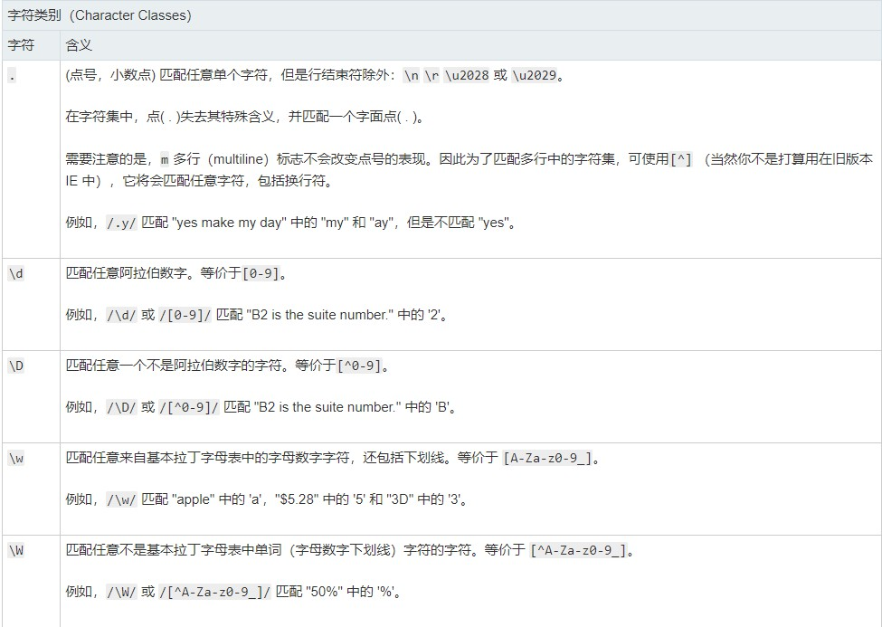
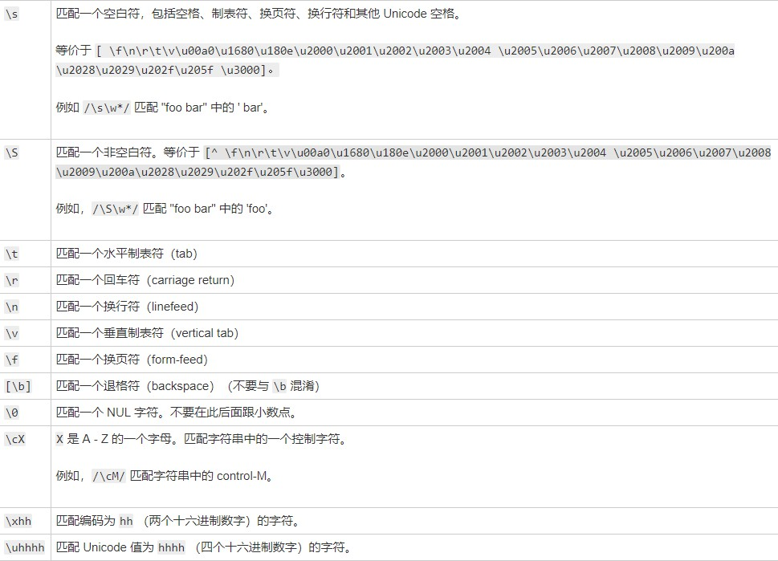
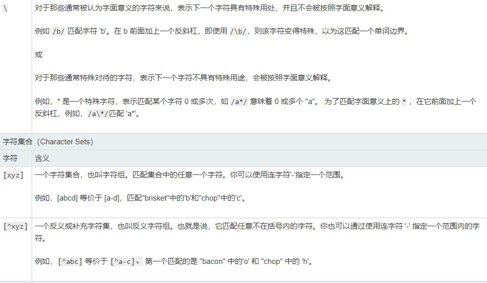
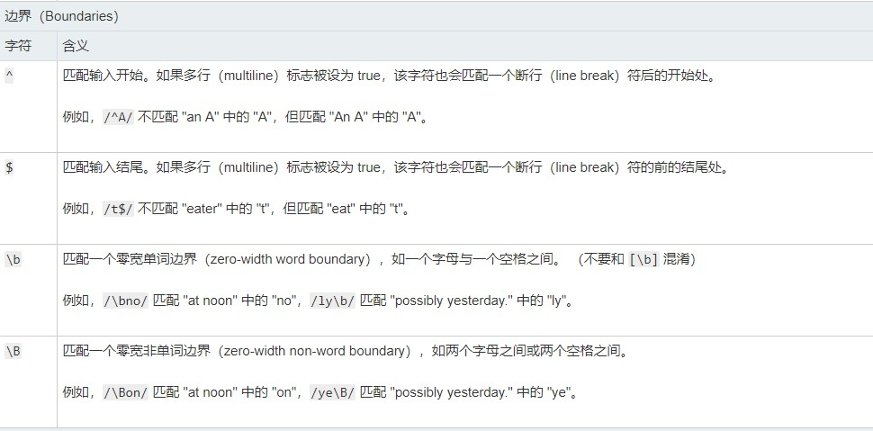
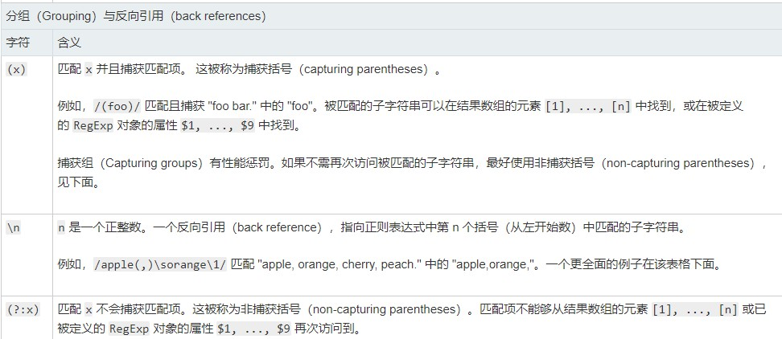
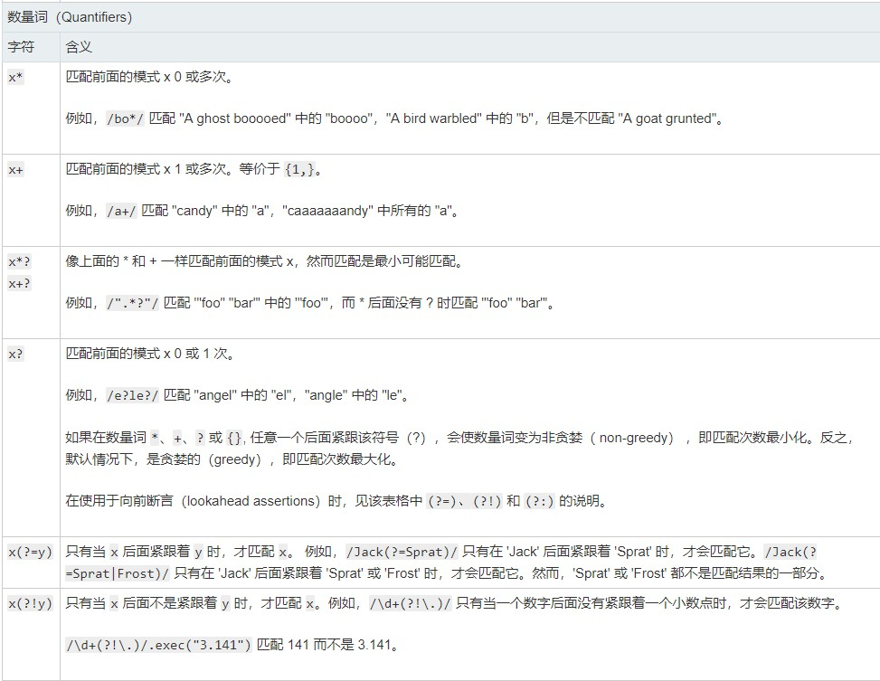
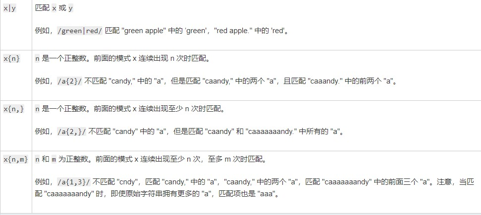


- ^等价于:[\t\n\v\f\r\u00a0\u2000\u2001\u2002\u2003\u2004\u2005\u2006\u2007\u2008\u2009\u200a\u200b\u2028\u2029\u3000]
- jq .show() .hide() .toggle()	显示隐藏
- .fadeIn(300) .fadeOut(300)  .fadeToggle(300) 淡入淡出 .fadeTo(2000, 0.7)
- .slideDown(2000) .slideUo(2000) .slideToggle(2000) 以定位的方向为准
- js 正则 str.match(/(\w+)(\w+)/g, function() | "$1 $2")	可以写方法 或字符串 $1 指的是第一个()匹配的字符串

| 变量名 	| 代表的值 	|
|--------	|------------------------------------------------------------------------------------------------------------------	|
| $$ 	| 插入一个$ 	|
| $& 	| 插入匹配的子串 	|
| $` 	| 插入当前匹配的子串左边的内容 	|
| $' 	| 插入当前匹配的子串右边的内容 	|
| $n 	| 假如第一个参数是  RegExp对象，并且 n 是个小于100的非负整数，那么插入第 n 个括号匹配的字符串。提示：索引是从1开始 	|

- 如果 replace 的第二个参数是函数

| 变量名 	| 代表的值 	|
|-------------	|---------------------------------------------------------------------------------------------------------------------------------------------------------------------------------------------	|
| match 	| 匹配的子串。（对应于上述的$&。） 	|
| p1, p2, ... 	| 假如replace()方法的第一个参数是一个 RegExp 对象，则代表第n个括号匹配的字符串。（对应于上述的$1，$2等。）例如, 如果是用  /(\a+)(\b+)/这个来匹配，  p1就是匹配的  \a+,   p2 就是匹配的  \b+。 	|
| offset 	| 匹配到的子字符串在原字符串中的偏移量。（比如，如果原字符串是“abcd”，匹配到的子字符串是“bc”，那么这个参数将是1） 	|
| string 	| 被匹配的原字符串。 	|

- append() prepend()
- jq 对象转 dom 对象
	- 取索引 [index]
	- .get(index)
- .play() .pause() 原生方法
- exec() 方法的功能非常强大，它是一个通用的方法，而且使用起来也比 test() 方法以及支持正则表达式的 String 对象的方法更为复杂。
```
如果 exec() 找到了匹配的文本，则返回一个结果数组。否则，返回 null。此数组的第 0 个元素是与正则表达式相匹配的文本，第 1 个元素是与 RegExpObject 的第 1 个子表达式相匹配的文本（如果有的话），第 2 个元素是与 RegExpObject 的第 2 个子表达式相匹配的文本（如果有的话），以此类推。除了数组元素和 length 属性之外，exec() 方法还返回两个属性。index 属性声明的是匹配文本的第一个字符的位置。input 属性则存放的是被检索的字符串 string。我们可以看得出，在调用非全局的 RegExp 对象的 exec() 方法时，返回的数组与调用方法 String.match() 返回的数组是相同的。
但是，当 RegExpObject 是一个全局正则表达式时，exec() 的行为就稍微复杂一些。它会在 RegExpObject 的 lastIndex 属性指定的字符处开始检索字符串 string。当 exec() 找到了与表达式相匹配的文本时，在匹配后，它将把 RegExpObject 的 lastIndex 属性设置为匹配文本的最后一个字符的下一个位置。这就是说，您可以通过反复调用 exec() 方法来遍历字符串中的所有匹配文本。当 exec() 再也找不到匹配的文本时，它将返回 null，并把 lastIndex 属性重置为 0。
提示和注释
重要事项：如果在一个字符串中完成了一次模式匹配之后要开始检索新的字符串，就必须手动地把 lastIndex 属性重置为 0。
提示：请注意，无论 RegExpObject 是否是全局模式，exec() 都会把完整的细节添加到它返回的数组中。这就是 exec() 与 String.match() 的不同之处，后者在全局模式下返回的信息要少得多。因此我们可以这么说，在循环中反复地调用 exec() 方法是唯一一种获得全局模式的完整模式匹配信息的方法。
```
- 使用正则改变数据结构
```JavaScript
var re = /(\w+)\s(\w+)/;
var str = "John Smith";
var newstr = str.replace(re, "$2, $1");
print(newstr);
// 显示 "Smith, John".
```
- 在多行中使用正则表达式
```JavaScript
ar s = "Please yes\nmake my day!";
s.match(/yes.*day/);
// Returns null
s.match(/yes[^]*day/);
// Returns 'yes\nmake my day'
```
- 使用带有 ”sticky“ 标志的正则表达式
```JavaScript
var text = "First line\nsecond line";
var regex = /(\S+) line\n?/y;

var match = regex.exec(text);
print(match[1]);  // prints "First"
print(regex.lastIndex); // prints 11

var match2 = regex.exec(text);
print(match2[1]); // prints "Second"
print(regex.lastIndex); // prints "22"

var match3 = regex.exec(text);
print(match3 === null); // prints "true"
```
- 可以使用 try { … } catch { … } 来测试运行时（run-time）是否支持 sticky 标志。这种情况下，必须使用 eval(…) 表达式或 RegExp(regex-string, flags-string) 语法（这是由于 /regex/flags 表示法将会在编译时刻被处理，因此在 catch 语句块处理异常前就会抛出一个异常。例如：
```JavaScript
var supports_sticky;
try { RegExp('','y'); supports_sticky = true; }
catch(e) { supports_sticky = false; }
alert(supports_sticky); // alerts "false" in Firefox 2, "true" in Firefox 3+
```

- 使用正则表达式和 Unicode 字符
- 正如上面表格提到的，\w 或 \W 只会匹配基本的 ASCII 字符；如 'a' 到 'z'、 'A' 到 'Z'、 0 到 9 及 '_'。为了匹配其他语言中的字符，如西里尔（Cyrillic）或 希伯来语（Hebrew），要使用 \uhhhh，"hhhh" 表示以十六进制表示的字符的 Unicode 值。下例展示了怎样从一个单词中分离出 Unicode 字符。
```JavaScript
var text = "Образец text на русском языке";
var regex = /[\u0400-\u04FF]+/g;
var match = regex.exec(text);
print(match[1]);  // prints "Образец"
print(regex.lastIndex);  // prints "7"
var match2 = regex.exec(text);
print(match2[1]);  // prints "на" [did not print "text"]
print(regex.lastIndex);  // prints "15"
// and so on
```
- 从 URL 中提取子域名
```JavaScript
var url = "http://xxx.domain.com";
print(/[^.]+/.exec(url)[0].substr(7)); // prints "xxx"
```
- jq .parents(selector) .parent(selector) .parentUtil(selector)
- jq .children()
- jq .find(selector) 向下遍历
- jq .next() .nextAll() .nextUtil() .pre() .preAll() .preUtil()

## day-4
- $("div").stop().fadeIn(500).sibings().stop().fadeOut(500);
- 创建元素节点 `$("<p></p>").html("hello world"); $("div").prepend(a) $("div").append(a);`
- apend() apendTo() 主动与被动
- .wrap() 给获取的每个元素加 .wrapAll() 给获取的元素集中后加
- .clone() 复制节点 .clone(true) 复制节点和节点行为
- remove() .detach() 这个方法不会把匹配的元素从jQuery对象中删除，因而可以在将来再使用这些匹配的元素。与remove()不同的是，所有绑定的事件、附加的数据等都会保留下来。
- empty() 清空节点内容
- `$("div:first") == $("div").eq(0)`
- :root 伪类 :root 伪类匹配文档树的根元素。应用到HTML，:root 即表示为 `<html>元素`，除了优先级更高外，相当于html标签选择器。
- CSS 命名
	- 布局：以 g 为命名空间，例如：g-wrap 、g-header、g-content
	- 状态：以 s 为命名空间，表示动态的、具有交互性质的状态，例如：s-current、s-selected
	- 工具：以 u 为命名空间，表示不耦合业务逻辑的、可复用的的工具，例如：u-clearfix、u-ellipsis
	- 组件：以 m 为命名空间，表示可复用、移植的组件模块，例如：m-slider、m-dropMenu
	- 钩子：以 j 为命名空间，表示特定给 JavaScript 调用的类名，例如：j-request、j-open
- BEM 命名规范：块（block）、元素（element）、修饰符（modifier），是由 Yandex 团队提出的一种 CSS Class 命名方法。
- replaceWith() 替换标签

## day-5
- animate() 方法执行 CSS 属性集的自定义动画。
	- 该方法通过CSS样式将元素从一个状态改变为另一个状态。CSS属性值是逐渐改变的，这样就可以创建动画效果。
	- 只有数字值可创建动画（比如 "margin:30px"）。字符串值无法创建动画（比如 "background-color:red"）。
- css 权重计算公式
	- 当很多元素被应用到某个元素上时，权重是一个决定那种规则生效，或者是优先级的过程。
	- 权重的等级与权值
	- 行内选择器（1000）
	- ID选择器（100）
	- 类，属性选择器和伪类选择器（10）
	- 元素选择器和伪元素选择器（1） 
	- 通配符选择器（0）
	- CSS权重规则
		1. 当多个选择器发生冲突时，会选择权重高的选择器来显示，权重越高越优先显示
		1. 比较时应该将多个选择器的权重进行相加再进行比较，如果权重一样后面的会覆盖前面的样式
		1. 权重相加不可能超过它自身的最大数量级，（例如：无论多少个类选择器相加也没有ID选择器的优先级高）
		1. 可以在样式后面添加 !important，这样样式将会拥有最大权重，其他样式都不能将其覆盖
- bind() unbind() 事件绑定
- scroll(function() {})	滚动事件
- event 对象
	- type 事件类型
	- target 获取绑定事件的 DOM 元素叠加才用
	- pageX/Y
	- clientX/Y
- 事件冒泡 子级把上级事件触发
```js
<div>
	<button id="btn"></button>
</div>

<script>
	document.onclick = function() {
		aler1(1);
		retrun false;	// 解决冒泡
	}
</script>
```
- $(window).scrollTop()	获取窗口距离顶部距离
- $("html, body").animate({"scrollTop": "0"}, 500);	事件源需要是 html, body
- $(selector).offset().top	距离顶部的距离
- JQury用双引号
- Form表单
- 一个页面可以有多个form
- form不可以嵌套
- form没有结束标签可能不会报错但出现不可预知的错误
- submit 提交并刷新当前form
- 多个form同时提交用ajaxsubmit()
- placeholder
- 属性提供可描述输入字段预期值的提示信息（hint）。
- 该提示会在输入字段为空时显示，并会在字段获得焦点时消失。
- 注释：placeholder 属性适用于以下的 <input> 类型：text, search, url, telephone, email 以及 password。
- 前端路由
- 根据URL的变化在前端进行逻辑处理。
- HTML 字符实体
- &laquo; << 
- &raquo; >>
- href="#"与href="javascript:void(0)"的区别
- # 包含了一个位置信息，默认的锚是#top 也就是网页的上端。
- 而javascript:void(0), 仅仅表示一个死链接。
- 在页面很长的时候会使用 # 来定位页面的具体位置，格式为：# + id。
- 如果你要定义一个死链接请使用 javascript:void(0) 。​
- Bootstrap HTML编码规范
- 用两个空格来代替制表符（tab） -- 这是唯一能保证在所有环境下获得一致展现的方法。
- 嵌套元素应当缩进一次（即两个空格）。
- 对于属性的定义，确保全部使用双引号，绝不要使用单引号。
- 不要在自闭合（self-closing）元素的尾部添加斜线 -- HTML5 规范中明确说明这是可选的。
- 不要省略可选的结束标签（closing tag）（例如，</li> 或 </body>）。
- Bootstrap data-
- bootstrap参数传递可以用 data-参数名
- 如：<div id="test" data-user="张三"></div>
- 取值的时候用jquery:
- 如：$('test').data('user')就可以取到 张三
- windows.onload 和 $(document).ready() 对比
- window.onload必须等到页面内包括图片的所有元素加载完毕后才能执行，$(document).ready()是DOM结构绘制完毕后就执行，不必等到加载完毕
- window.onload不能同时编写多个，如果有多个window.onload方法，只会执行一个，$(document).ready()可以同时编写多个，并且都可以得到执行
- window.onload没有简化写法，$(document).ready(function(){})可以简写成$(function(){})
- border-style 取值
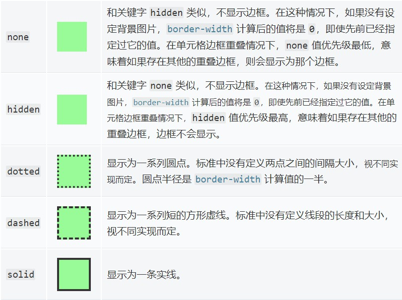
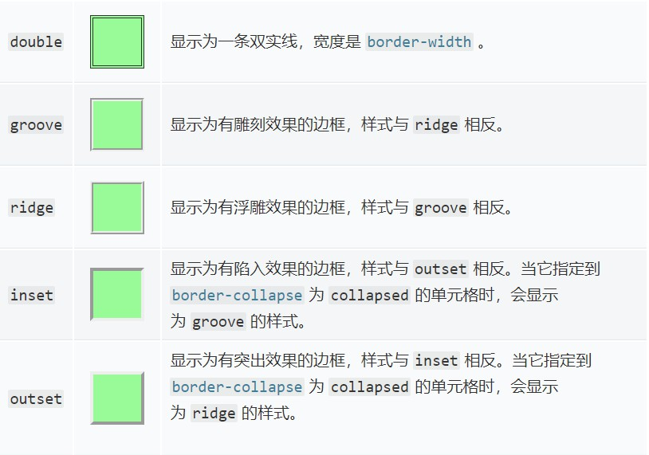

## week-5

## day-1

- 四个通用属性：style id class title
- cursor : help; // 问号
- setInterval("func()", 1000) \n setInterval(func, 1000)    // 正确
- 关于 Array | string
	- .substring() 只有 String 有
	- .slice() Array 和 String 都有
	- .slice() 和 .splice() 区别
		- .slice(\<start>, \<end>) return Array()	截取元素
		- .splice(index, howmany, item) return remove item [] 修改元素或添加元素或截取元素
			- splice(1, 2,)		删除从下标 1 开始的两个元素
			- splice(1, 0, 1)   在小标为 1 的元素后插入一个 1
			- splice(1, 2, "")  修改从下标 1 开始的两个元素为 ""
			- splice(1, 0, [12,12]) 插入一个数组
- [emmet 语法](https://docs.emmet.io/abbreviations/syntax/)
	- id div#id
	- class div.class
	- 子代 div>div
	- 兄弟 div+div
	- 父代 div>ul>li^span
	- 重复 ul>li*3
	- 分组 div>(ul>li*3)+(ul>li*2)
	- 生成自定义属性[attr] a[href="1" title="2"]
	- 生成内容编号 ul>li.item$*5  ul>li.item$$$*5 三位数
	- 倒序 ul>li.item$@-*5
	- @N指定开始的序号  ul>li.item$@3*5
	- 生成文本内容{} a[href="#"]>{content}
- 屏幕大小
	- 超小屏幕 手机（<768px）
	- 小屏幕 平板（>=768px）
	- 中等屏幕 桌面（>=992px）
	- 大屏幕 桌面（>=1200px）
- bs3 可用类
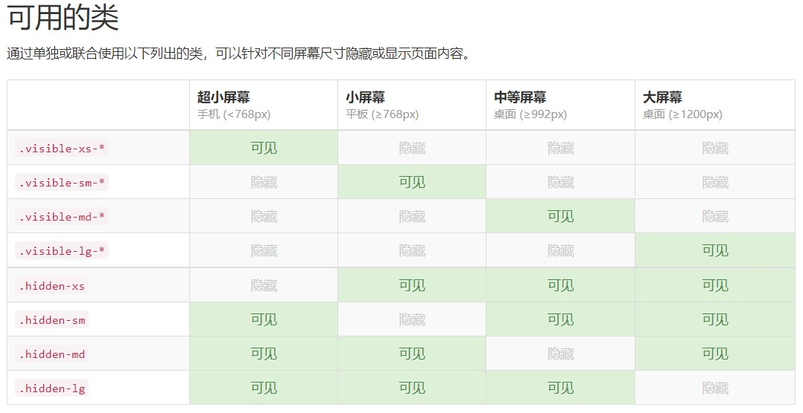
- input[type="button"] 和 \<a> 和 \<button> 区别
	- input a 是内联元素 button 是可变元素
	- input 是单标签 button、a 是双标签
	- input 带 value
	- button、a 有 css 主导权
HTML5新增元素、标签总结
总是遇到h5新标签的笔试题目，就查阅了资料来总结一下：
- form相关：
1. form属性：在HTML5中表单元素可放在表单之外，通过给该元素添加form属性来指向目标表单（form属性值设为目标表单id）即可。
2. formaction属性：HTML5给提交按钮(如button、submit、image等)增加了formaction属性，以便提交到不同的服务器地址。

```<input formaction="new.html" type="submit" value="提交到new.html">```

3. formmethod属性：用法同formaction。
4. placeholder属性：用于文本框处于未输入状态时的一种文字提示。
5. autofocus属性：自动获得焦点，一个页面只能有一个控件具有该属性。该属性无值，直接写就好。

```<input name="username" autofocus type="text" id="username">```

6. list属性：用于单行文本框，该属性的值为某个datalist元素的id，增加该属性后的单行文本框类似选择框(select)，但允许用户自定义输入，为了避免没有支持该元素的浏览器出现错误，我们通常使用CSS设置不显示。
datalist 标签:定义可选数据的列表。与 input 元素配合使用，就可以制作出输入值的下拉列表。
7. autocomplete属性：自动完成允许浏览器预测对字段的输入，HTML5实现了自定义设置该属性，避免了任何人都可以看到所存在的安全隐患。该属性值有“on”、”off“或“”(不指定)三种，不指定时使用浏览器的默认值。
8. input元素种类：

```text
search：与text文本框类似，用于搜索；
tel： 与text文本框类似，用于电话；
url： 与text文本框类似，用于url格式的地址；
email： 与text文本框类似，用于email格式的地址；
number： 与text文本框类似，用于数值；
range： 只允许输入一段范围内的数值，通过min和max属性来设置范围；
color： 颜色文本框，“#000000”格式的文字；
file： 文件选择文本框，HTML5中通过multiple属性可以多选；
datetime、date、month、week、time、datetime-local 各种日期与时间输入的文本框；
output： 定义不同类型的输出；
```

9. 表单验证相关：
自动验证（就是通过为元素添加相应的属性来达到验证的要求）
required属性：具有该属性的元素，如果其内容为空则不允许提交，并给出相应的提示。
pattern属性：具有该属性的元素，如果内容不为空则把内容与pattern的值进行正则匹配，匹配不成功则不通过并提示。
min属性和max属性：它们是值类型和日期类型的input元素专用属性，限制了输入的范围。
step属性：控制元素的值增加或减少的步幅，如输入1-100之间的数字，且步幅是5，那么只能输入1、6、11....。
显示验证（除了给元素添加属性来自动验证外，在HTML5中，form元素与输入元素(input)包括select元素和textarea都具有一个checkValidity方法，调用该方法可以进行手动验证，checkValidity方法以boolean的形式返回验证结果）
取消验证（取消表单验证有两个属性：用于form的novalidate和用于submit的formnovalidate）
自定义错误：在HTML5中没经过验证的表单浏览器会有默认的提示，但也提供了通过JavaScript的来设置自定义错误提示信息。（我觉得就是自己写个函数，点击时候调用就可以）

- 增强的页面元素

1. figure元素：figure是个组合元素，可以带标题figcaption，一个figure只允许放置一个figcaption。

```html
<figure>

<figcaption>标志</figcaption>
</figure>
```

2. details元素:details提供了一种替代Javascript的、将画面上局部区域进行展开或收缩的方法.

```html
<details>
<summary>点击我查看细节</summary>
<p>我是细节内容。</p>
</details>
```

3. mark元素：mark元素表示页面需要突出显示或高亮显示的部分。
4. progress元素：一般用于写进度条，可以给progress设置value和max属性，value表示已经进行的，max表示总数，value和max只能为有效的浮点数，value必须大于0小于等于max。如果不给progress设置这两个属性，则是动态显示正在进行，进度不确定。
5. meter元素：定义度量衡。（界定上下的值会有颜色区分）。
high:定义度量的值位于哪个点，被界定为高的值。
low:定义度量的值位于哪个点，被界定为低的值。
max:定义最大值。默认值是 1。
min:定义最小值。默认值是 0。
optimum:定义什么样的度量值是最佳的值,如果该值高于 "high" 属性，则意味着值越高越好。值低于"low" 属性的值，则意味着值越低越好。
value:定义度量的值。
6. 改良的ol列表：在HTML5中为ol元素添加了start属性和reversed属性。
start：表示列表序号从几开始。
reversed：表示列表序号为倒序。
7. 改良的dl列表：dl是专门用来定义术语的列表，在HTML5中为dt增加了名字dfn。
8. cite:用于表示作者。
9. mall:用于标识“小型文本”。
10. article 标签:定义外部的内容。
11. aside 标签:定义 article 以外的内容。aside 的内容应该与 article 的内容相关。aside可以用于网站页尾一排排的广告或者链接，一竖排为一个aside。也可以用于博客侧栏。
12. audio 标签：定义声音。
13. canvas 标签：定义图形（是为了客户端矢量图形而设计的）。
14. command 标签：定义命令按钮，比如单选按钮、复选框或按钮。
15. embed 标签:定义嵌入的内容，比如插件。
16. footer 标签：定义 section 或 document 的页脚。
17. header 标签：定义 section 或 document 的页眉。
18. hgroup 标签：用于对网页或区段（section）的标题进行组合。
19. hgroup 标签：用于对网页或区段（section）的标题进行组合。
20. nav 标签：定义导航链接的部分。
21. output 标签：定义不同类型的输出，比如脚本的输出。
22. rp 标签：在 ruby 注释中使用，以定义不支持 ruby 元素的浏览器所显示的内容。
23. rt 标签：定义字符（中文注音或字符）的解释或发音。
24. ruby 标签：定义 ruby 注释（中文注音或字符）。
25. section 标签：定义文档中的节（section、区段）。比如章节、页眉、页脚或文档中的其他部分。
26. source 标签：为媒介元素（比如 \<video> 和 \<audio>）定义媒介资源。
27. summary 标签：details 元素的标题，”details” 元素用于描述有关文档或文档片段的详细信息。”summary” 元素应该是 “details” 元素的第一个子元素。
28. time 标签：定义日期或时间，或者两者。
29. video 标签：定义视频，比如电影片段或其他视频流。
30. dialog标签：定义对话（会话）dialog元素表示几个人之间的对话。
- 媒体查询 @media (min-width: 1100px) {}
- 栅格系统
	1. 利用媒体查询和最小宽高
	2. row 必须在 container 里
	3. 12 份

## [chokcoco/iCSS](https://github.com/chokcoco/iCSS)

- FC 即是 Formatting Contexts ，译作格式化上下文。 *FC 可以称作视觉格式化模型。CSS 视觉格式化模型(visual formatting model)是用来处理文档并将它显示在视觉媒体上的机制。这是 CSS 的一个基础概念。
- 比较常见的是 CSS2.1 规范中的 IFC（Inline Formatting Contexts）与 BFC（Block Formatting Contexts），至于后面两个，则是 CSS3 新增规范，GFC（GridLayout Formatting Contexts）以及 FFC（Flex Formatting Context）。
- FC 是网页CSS视觉渲染的一部分，用于决定盒子模型的布局、其子元素将如何定位以及和其他元素的关系和相互作用。
- 理解各种 FC 背后的原理是掌握各类 CSS 布局的关键。
先了解几个概念，
Box
Box 是 CSS 布局的对象和基本单位，直观点说就是一个页面是由很多个 Box (即boxes)组成的，元素的类型和 display 属性决定了 Box 的类型。
block-level Box：当元素的 CSS 属性 display 为 block, list-item 或 table 时，它是块级元素 block-level 。块级元素（比如<p>)视觉上呈现为块，竖直排列。
每个块级元素至少生成一个块级盒（block-level Box）参与 BFC ，称为主要块级盒(principal block-level box)。一些元素，比如<li>，生成额外的盒来放置项目符号，不过多数元素只生成一个主要块级盒。
Inline-level Box：当元素的 CSS 属性 display 的计算值为 inline, inline-block 或 inline-table 时，称它为行内级元素。视觉上它将内容与其它行内级元素排列为多行。典型的如段落内容，有文本或图片，都是行内级元素。
行内级元素生成行内级盒(inline-level boxes)，参与行内格式化上下文 IFC 。
flex container：当元素的 CSS 属性 display 的计算值为 flex 或 inline-flex ，称它为弹性容器。
display:flex这个值会导致一个元素生成一个块级（block-level）弹性容器框。
display:inline-flex这个值会导致一个元素生成一个行内级（inline-level）弹性容器框。
grid container：当元素的 CSS 属性 display 的计算值为 grid 或 inline-grid，称它为栅格容器。
栅格盒模型值，是一个仍处于实验中的属性。
块容器盒（block container box）
只包含其它块级盒，或生成一个行内格式化上下文(inline formatting context)，只包含行内盒的叫做块容器盒子。
也就是说，块容器盒要么只包含行内级盒，要么只包含块级盒。
块级盒（block-level Box）是描述元素跟它的父元素与兄弟元素之间的表现。
块容器盒（block container box）描述元素跟它的后代之间的影响。
块盒（BLock Boxes）
同时是块容器盒的块级盒称为块盒(block boxes)
顶住，概念真的很多。。。
行盒(Line boxes)
行盒由行内格式化上下文(inline formatting context)产生的盒，用于表示一行。在块盒里面，行盒从块盒一边排版到另一边。 当有浮动时, 行盒从左浮动的最右边排版到右浮动的最左边。
IFC（Inline Formatting Contexts）行内级格式化上下文
行内级格式化上下文用来规定行内级盒子的格式化规则。
先来看看如何生成一个 IFC ：
IFC 只有在一个块级元素中仅包含内联级别元素时才会生成。
布局规则
内部的盒子会在水平方向，一个接一个地放置。
这些盒子垂直方向的起点从包含块盒子的顶部开始。
摆放这些盒子的时候，它们在水平方向上的 padding、border、margin 所占用的空间都会被考虑在内。
在垂直方向上，这些框可能会以不同形式来对齐（vertical-align）：它们可能会使用底部或顶部对齐，也可能通过其内部的文本基线（baseline）对齐。
能把在一行上的框都完全包含进去的一个矩形区域，被称为该行的行框（line box）。行框的宽度是由包含块（containing box）和存在的浮动来决定。
IFC中的 line box 一般左右边都贴紧其包含块，但是会因为float元素的存在发生变化。float 元素会位于IFC与与 line box 之间，使得 line box 宽度缩短。
IFC 中的 line box 高度由 CSS 行高计算规则来确定，同个 IFC 下的多个 line box 高度可能会不同（比如一行包含了较高的图片，而另一行只有文本）
当 inline-level boxes 的总宽度少于包含它们的 line box 时，其水平渲染规则由 text-align 属性来确定，如果取值为 justify，那么浏览器会对 inline-boxes（注意不是inline-table 和 inline-block boxes）中的文字和空格做出拉伸。
当一个 inline box 超过 line box 的宽度时，它会被分割成多个boxes，这些 boxes 被分布在多个 line box 里。如果一个 inline box 不能被分割（比如只包含单个字符，或 word-breaking 机制被禁用，或该行内框受 white-space 属性值为 nowrap 或 pre 的影响），那么这个 inline box 将溢出这个 line box。
那么，IFC 的具体实用在何处呢？
水平居中：当一个块要在环境中水平居中时，设置其为 inline-block 则会在外层产生 IFC，通过设置父容器 text-align:center 则可以使其水平居中。
值得注意的是，设置一个块为 inline-block ，以单个封闭块来参与外部的 IFC，而内部则生成了一个 BFC。
垂直居中：创建一个IFC，用其中一个元素撑开父元素的高度，然后设置其 vertical-align:middle，其他行内元素则可以在此父元素下垂直居中。
使用 IFC 可以实现多行文本的水平垂直居中，可以看看下面这个例子：
Demo戳我：使用 IFC 可以实现多行文本的水平垂直居中
BFC（Block Formatting Contexts）块级格式化上下文
块格式化上下文（block formatting context） 是页面上的一个独立的渲染区域，容器里面的子元素不会在布局上影响到外面的元素。它是决定块盒子的布局及浮动元素相互影响的一个因素。
下列情况将创建一个块格式化上下文：
根元素或其它包含它的元素
浮动 (元素的 float 不为 none)
绝对定位元素 (元素的 position 为 absolute 或 fixed)
行内块 inline-blocks (元素的 display: inline-block)
表格单元格 (元素的 display: table-cell，HTML表格单元格默认属性)
表格标题 (元素的 display: table-caption, HTML表格标题默认属性)
overflow 的值不为 visible的元素
弹性盒子 flex boxes (元素的 display: flex 或 inline-flex)
块格式化上下文包括了创建该上下文的元素的所有子元素，但不包括创建了新的块格式化上下文的子元素。
包含浮动元素的块塌缩，清除浮动等都是 BFC 的应用场景。
GFC（Grid Formatting Contexts）栅格格式化上下文
display:grid 篇幅巨大，建议看完大漠老师的教程：
CSS Grid布局
FFC（Flex Formatting Contexts）Flex格式化上下文
如上所述，当 display 的值为 flex 或 inline-flex 时，将生成弹性容器（Flex Containers）。
一个弹性容器为其内容建立了一个新的弹性格式化上下文环境（FFC）。
值得注意的是，弹性容器不是块容器，下列适用于块布局的属性不适用于弹性布局：
在CSS3多列布局模块中定义的 column-* 属性不适用于弹性容器。
float 和 clear 属性对于弹性项没有作用，并不会把它带离文档流（或相反）。然而，浮动属性仍然会通过影响display属性的计算值而影响box的生成。
vertical-align 属性对于弹性项没有作用
::first-line 和 ::first-letter 伪元素不适用于弹性容器，而且弹性容器不为他们的祖先提供第一个格式化的行或第一个字母。
看看下面的结构，
<div class="box">
    <div class="item"></div>
    <div class="item"></div>
    <div class="item"></div>
</div>
.box{
  display: flex;
}
如上所示，采用 Flex 布局的元素，称为 Flex 容器（flex container），简称"容器"。弹性容器中的弹性项（flex item）表示其文档流（in-flow）内容中的框。
display:flex 篇幅巨大，建议看完下面两篇：
阮一峰--Flex 布局教程
弹性块布局
借用一句话：“’在工作过程中遇到某个属性的使用，浏览器渲染效果与预期效果不符，只能通过死记硬背能避免或应用这种效果，不知晓背后的原理，用就是这样的的借口来搪塞自己。”，所以对于布局问题，不要死记硬背，要去理解背后的各种原理。

## day-2
- Bootstrap
	- .col-xs-* .col-sm-* .col-md-* .col-lg-*
	- 列偏移 .col-*-offset-*
	- 列排序 .col-*-push-* .col-*-pull-* 左 右
- [Glyphicons 字体图标](https://v3.bootcss.com/components/) - `<div class="glyphicon glyphicon-ok"></div>`
- class nav-fixed-top 导航固定到顶部
- 流式布局容器 - `将最外面的布局元素 .container 修改为 .container-fluid, 就可以将固定宽度的栅格布局转换为 100% 宽度` 
- 媒体对象 vertical-

## day-3

## day-4
- js 事件
	- dom 0 1 2 级
	- html 级
- body margin default 8px
- list-style: none 写在特定块里
- [1] != [1]	两个对象
- [1,2] + [1,2] => [1,21,2]
- 尽可能让函数的功能最小化
- document.style.cssText = ""
- javascript 创建伪对象

```js
function Object(param) {
	var obj = {
		let a, b;
		func1: function() {
			param = 1;
		},
		func1: function() {},
	}
}
var c;
var obj = new Object(c);
obj1.func1();
```