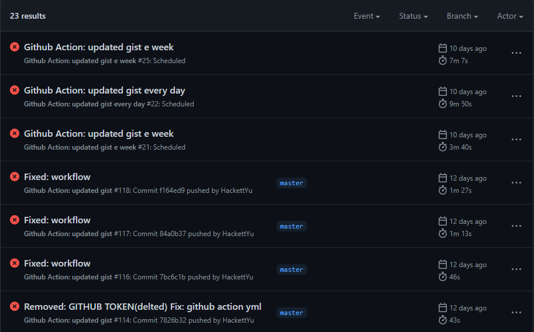

# 启用 Github action debug

我刚开始使用 Github workflow 的时候运行了许多 failure Action

## 启动日志

> 要启用运行程序诊断日志，请在包含工作流程的仓库中设置以下密码：将 ACTIONS_RUNNER_DEBUG 设置为 true

PS：进入 Repo>Settings>Secret 设置

## 设置退出

https://docs.github.com/cn/actions/creating-actions/setting-exit-codes-for-actions

## Reference

- https://docs.github.com/cn/actions/managing-workflow-runs/enabling-debug-logging
- https://docs.github.com/cn/actions/reference/workflow-commands-for-github-actions#使用工作流程命令访问工具包函数
- https://github.com/actions/toolkit
- https://docs.github.com/cn/actions/creating-actions/metadata-syntax-for-github-actions#inputs
- https://docs.github.com/cn/actions/creating-actions/metadata-syntax-for-github-actions#outputs