# Java-Note Java

## Java 基础

- 基本类型和引用类型的区别


- byte 8bit short 16bit int 32bit

- byte 取值范围 -128 - 127

| B | D |
| --- | --- |
| 0111 1111 | 127 |
| 0000 0000 | 0 |
| 1111 1111 | -1 |
| 1111 1110 | -2 |
| 1111 1101 | -3 |
| 1111 1100 | -4 |

- java 默认浮点类型 float
- byte short char 不会相互转换
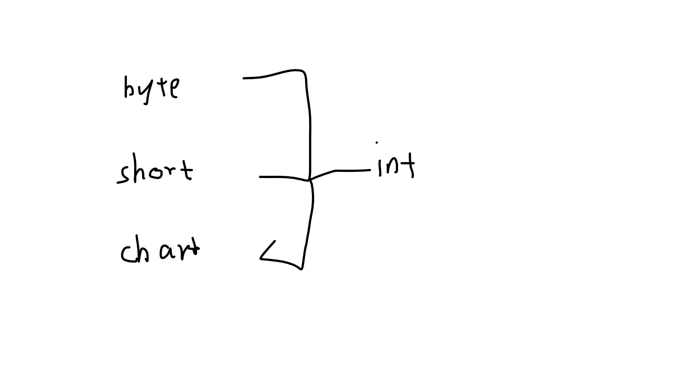

```java
int p = 100;
p = p++;
System.out.println(p++);    // 100
System.out.println(p);    / 101
```

```java
System.out.println(5%3);    // 2
System.out.println(-5%3);   // -2
System.out.println(-5%-3);  // -2
System.out.println(5%-3);   // 2

System.out.println(5/2); // 2
System.out.println(5.0/2); // 2.5
```

- 导包 ctrl + shift + O
- ==比较的是2个对象的地址，而equals比较的是2个对象的内容

```java
 public int compareTo(String anotherString) {
    int len1 = value.length;
    int len2 = anotherString.value.length;
    int lim = Math.min(len1, len2);
    char v1[] = value;
    char v2[] = anotherString.value;
    int k = 0;
    while (k < lim) {
        char c1 = v1[k];
        char c2 = v2[k];
        if (c1 != c2) {
            return c1 - c2;
        }
        k++;
    }
    return len1 - len2;
}
```

- compareTo 如果在短长度范围内存在不同字符，则返回不同字符的差，否则返回长度的差；
- switch 可以接受 int byte char short String

```java
StringBuffer sb =new StringBuffer("abcd");
System.out.println(sb.reverse().toString());
//输出结果：dcba；
//备注：此方法针对的是io流，不能针对字符串。
```

```text
Java内存模型要求lock、unlock、read、load、use、assign、store、write这8个操作都具有原子性。但是对于64位的数据类型（long和double），在模型中特别定义了一条相对宽松的规定：允许虚拟机将没有被volatile修饰的64位数据读写操作划分为2次32位的操作来进行，即允许虚拟机实现选择可以不保证64位数据类型的read、load、store、write这4个操作的原子性。这点就是所谓的long和double的非原子协定。
```

- static 是类的方法 普通方法是对象的  普通方法不能直接调用
- static静态方法是存储在静态存储区内的，可以通过类.方法名直接进行调用，不需要进行实例化。
- 静态方法中是不允许使用this关键字的，因为它并不唯一属于任何一个对象
- `static 方法方便在没有创建对象的情况下来进行调用（方法/变量）`
- static 能在类内方便调用，在另一个类则等价于普通方法一样创建一个对象使用。
- 方法的重载：一个类里存在重复名字的方法；

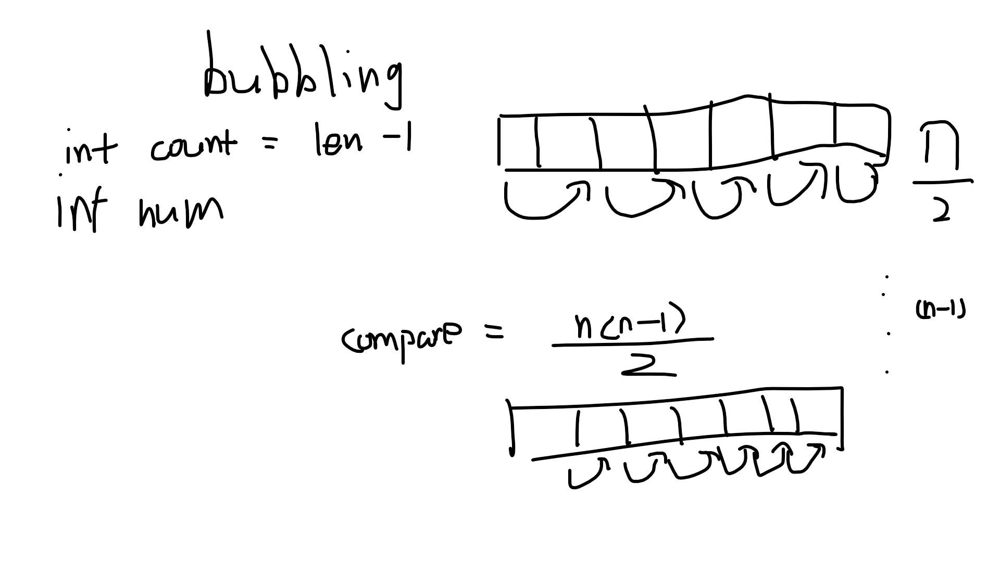


```java
public class Test extends Base{ // 继承
    static{
        System.out.println("test static");
    }
    public Test(){
        System.out.println("test constructor");
    }
    public static void main(String[] args) {    // 入口
        new Test();
    }
}
class Base{
    static{
        System.out.println("base static");
    }
    public Base(){
        System.out.println("base constructor"); // 构造方法
    }
}
```

## day-2

- 面向对象解决问题的思路：把构成问题域的事物分解成各个对象，给对象赋予相应的属性和行为，通过各个对象的相互协调来解决问题。
- 继承也称泛化
- 通过子类提取父类叫抽象
- java 三大特性：多态（方法、对象）、继承、封装
- Object 9 个公共方法

- Java 变量
    首字母是英文字母、$
    内容是下划线，由字母、数字、美元符和下划线组成
    对大小写敏感
    非关键字

- Boolean default false（0）

```Java
//int i = 1;
for(int i = 2; i < 3; i ++) {
}
```

- 成员变量 = 实例变量

```java
int a;  // 实例的变量
static int b; // 类的变量，实例共享，即全局
```

- 垃圾回收机制 （GC） finalize()
    对象的引用赋值为 null O o = new O(); o = null;
    一次性使用的匿名对象    new O().f();
    超出生命周期

```java
for(int i=0; i < 10; ++i)
    O o = new O();
```

- int num = 1000_0000;

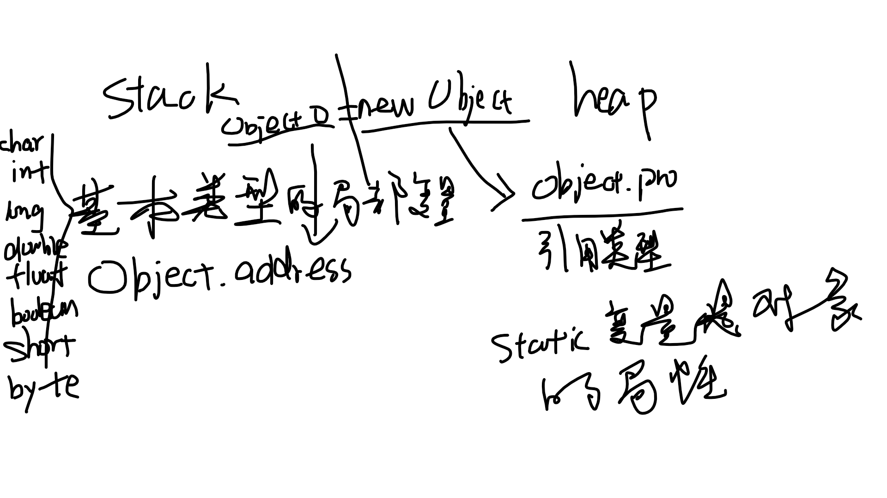
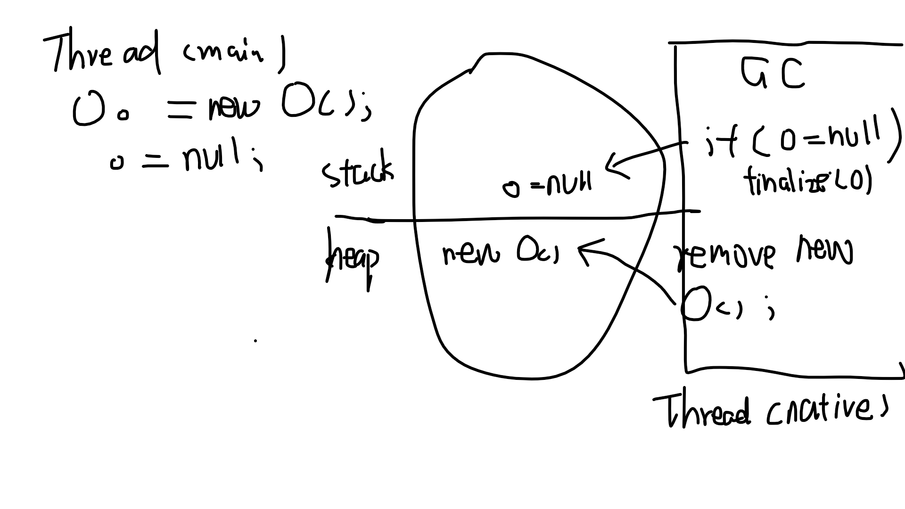

```text
String 类
String str   str是对象
String str = "abc";  "abc"是实例，也是对象.
这样也能解释instance of object这种说法  str的实例是"abc"
```

```java
@param int num
@param String name
class Test {
    int num;
    String name;
    Test(String name) {
        // invoke 自身成员变量
        this.name = name;
    }

    Test(int num) {
        // 调用自身构造方法
        this(this.name);
        this.num = num;
    }
}
```

- Integer 可接受 null

- super和this关键字
    super()
        作用：调用父类的构造器
        只能出现在子类的构造器中，且必须是第一行
        super()中的参数，决定了调用父类哪个构造器
        如果子类构造器中没有出现super，那么编译器会默认加上super()，即调用父类的    空构造器，如果父类没有空构造器，编译器提示错误。
    this()
        作用：调用本类的构造器
        只能写在构造器的第一行
        在同一个构造器中super()和this()不能同时出现

- 静态导入 import static java.lang.System.out;
- 子类继承父类后如果有方法名一样的方法，要么重写要么重载
- 向上转换损失了子类新扩展的属性和方法，仅可以使用从父类中继承的属性和方法

- 单例模式实现：
    拥有一个私有构造器 
    提供一个自身静态私有的成员变量
    提供一个公有的静态公有的方法

- 抽象方法的类必须是抽象类（除非你是接口），抽象类可以有任意个抽象方法
- 接口不能定义非静态变量，可以是常量、`抽象`方法（可不写 abstract）和非抽象的静态方法（要实现，静态方法要有实现）、（final static public）的属性
- 接口和抽象类不能实例化
- 继承抽象类或实现接口后抽象方法必须全部实现

```java
static class Outer {
    static class Inner {
        void foo();
    }
}

static void main(String[] a) {
    Outer.Inner oi = new Outer.Inner();
    oi.foo();
}
```

## day-6

- 异常
    非检查 （Runtime）

    检查 （IO）

```Java
AnnotationTypeMismatchException
ArithmeticException
ArrayStoreException
BufferOverflowException
BufferUnderflowException
CannotRedoException
CannotUndoException
ClassCastException
CMMException
CompletionException
ConcurrentModificationException
DataBindingException
DateTimeException
DOMException
EmptyStackException
EnumConstantNotPresentException
EventException
FileSystemAlreadyExistsException
FileSystemNotFoundException
IllegalArgumentException
IllegalMonitorStateException
IllegalPathStateException
IllegalStateException
IllformedLocaleException
ImagingOpException
IncompleteAnnotationException
IndexOutOfBoundsException
JMRuntimeException
LSException
MalformedParameterizedTypeException
MalformedParametersException
MirroredTypesException
MissingResourceException
NegativeArraySizeException
NoSuchElementException
NoSuchMechanismException
NullPointerException
ProfileDataException
ProviderException
ProviderNotFoundException
RasterFormatException
RejectedExecutionException
SecurityException
SystemException
TypeConstraintException
TypeNotPresentException
UncheckedIOException
UndeclaredThrowableException
UnknownEntityException
UnmodifiableSetException
UnsupportedOperationException
WebServiceException
WrongMethodTypeException
```

```java
// 不包括子类型， JDK 7 后可以捕获多个异常
try {
} catch(NamingException | RuntimeException e1) {
    e1.printStackTrace();
} catch(XAException e2) {
    e2.printStackTrace();
} finally {

}
```

- 匿名内部类可以实例化抽象类和接口

```java
public MyException extend Exception {
    public MyException(String msg) {
        System.out.println(msg);
    }
}

throw new MyException("");
```

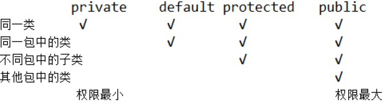

```text
select colum from table1 [left, right, all] [, outer] join table2 on condition;

-增加主键
     alter table 表名 add constraint 主键名 primary key (字段名1);

-增加外键:
     alter table 表名
       add constraint 外键名 foreign key (字段名1)
         references 关联表 (字段名2);

在建立表格时就指定主键和外键

    create table T_STU (
      STU_ID               char(5)                         not null,
       STU_NAME             varchar2(8)                     not null,
      constraint PK_T_STU primary key (STU_ID)
);

create squence seq_class_id;
select seq_class_id.nextval from dual
create index id_name on tab_teacher(field);

现在来看看MySQL数据库为我们提供的四种隔离级别：

Serializable (串行化)：可避免脏读、不可重复读、幻读的发生
Repeatable read (可重复读)：可避免脏读、不可重复读的发生
Read committed (读已提交)：可避免脏读的发生
Read uncommitted (读未提交)：最低级别，任何情况都无法保证。
```

- equal() 要看比较的是什么 String 默认是比较值

- 基本类型的封装类

| 基本类型 | 封装类 |
| - | - |

```java
Integer ig1 = 12;
int i1 = 12;
ig1 = i1;	// 自动装箱	可以调用 Integer 里的方法
i1 = ig1; // 自动拆箱
```

```java
String s1 = "1";
String s2 = "1";    // 静态
System.out.println(s1 == s2);   // true

String s3 = new String("1");    // 动态
System.out.println(s1 == s3);   // false
```

- 字符串构造方法

```java
String s1 = new String();
String s2 = "";
String s3 = new String("");
String s4 = new String(new StringBuffer(""));   // StringBuffer 可伸缩
String s5 = new String("".getByte(), "utf-8");  // (Byte[], charset) 解码
// "".getByte("utf-8"); // 要抛异常，编码
String s6 = null;
try {
    s4 = new String("我爱中国啊".getBytes(), 0, 3, "utf-8");
} catch (UnsupportedEncodingException e) {
    e.printStackTrace();
} // (Byte[], offset, length, charset)
String s7 = new String("".toCharArray());
```

```java
String str1 = "1,23,23,323,32,23";
System.out.println(Arrays.toString(str1.split(",")));
```

```java
System.out.println('0' < 1);// false
System.out.println('0' == 48);// true
System.out.println('0' < '1');// true
```

```java
System.out.println("12".substring(0, 1));   // 1
```

- java split（）使用“.” “\” "|" "*" "+"要转义

```java
public static void main(String[] args){
        Scanner in = new Scanner(System.in);
        String string=in.nextLine();
        //要使用"."分割，必须使用\\转义：如：split("\\.");
        //regex为\\\\，因为在java中\\表示一个\，而regex中\\也表示\，所以当\\\\解析成regex的时候为\\。 
        String[] strs=string.split("\\\\");
        for(String s:strs){
            System.out.println(s);
        }
    }
```

- CharSequence
    | String
    | StringBuffer (线程安全) 可伸缩 synchronized
    | StringBuilder (线程不安全)

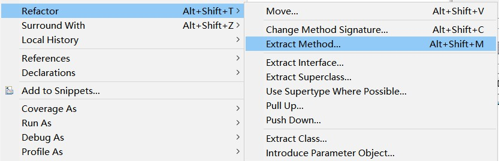
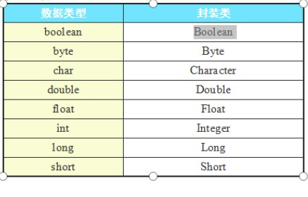
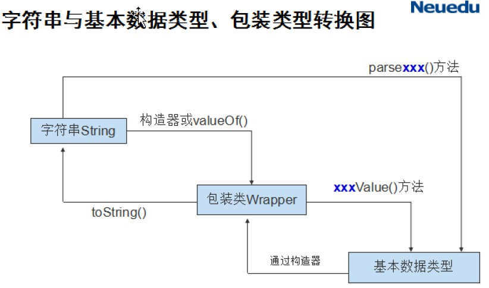

- StringBuffer deleteCharAt(int index)    删除指定位置
- StringBuffer delete(int start, int end) 删除 [s, e-1]

- new java.sql.util.Date(new java.sql.util.Date().getTime()); // util -> sql Date
- Calendar c = Calendar.getIntance();

```java
SimpleDateFormat sdf = new SimpleDateFormat("yyyy-MM-dd HH:mm:ss")
try {
    sdf.parse("2019 0830");
} catch(ParseException e) {
    e.printStackTrace();
}
```

- ArrayList (Vector 是加锁版本的 ArrayList)

```java
List list = new ArrayList(); // List is interface;
list(12);   // 12 隐式转换成 Integer 是引用类型
List<Integer> list1 = new ArrayList<>();    //后面的泛型可以省略
```

| ArrayList | Set |
| - | - |
| 有序 | 无序（自动排序）|
| 有重复 | 无重复 |
| 有空值 | 无空值 |

- ArrayList alist1.retain(alist2) alist1 保留 alist2 中有的元素，如果 alist 改变返回 true

- String 和 Integer 的 hashCode() 被重写获取的值与自身的值相等
- foreach 的临时变量是引用类型 Integer...

- toString() 方法默认返回：对象类型的完整类名 + @ + 该对象内存地址的十六进制形式

```java  
getClass().getName() + "@" + Integer.toHexString(hashCode());
```

- 要想判断两个 StringBuffer 变量的内容是否相等，应该先用 toString() 将它们转换成 String 对象
- StringBuffer 节省内存开销

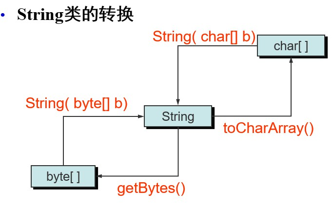
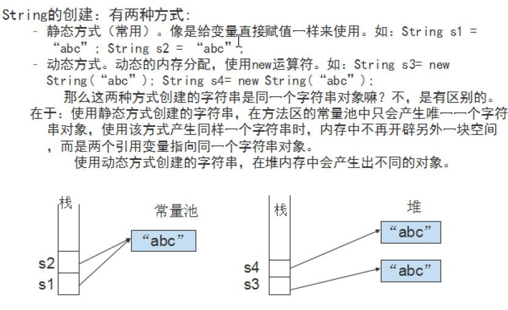

- String 和 StringBuffer 不属于八种基本数据类型，而是一种引用类型
- String 对象代表一组不可变的 Unicode 字符序列， 对它的任何实际操作实际又产生了一个新的字符串，String 一旦初始化就不再改变
- List 单列集合 Map 双列集合

```java
List<?> l1 = new LinkedList<?>(new ArrayList<?>());
```

```java
List<Object> l1 = new LinkedList<>();
l1.add("1");    // 
l1.remove(new String("1"));
// System.out.println(l1.get(0)); // erro
l1.add(1);
l1.remove(new Integer(1));
// System.out.println(l1.get(0)); // error
```

- set 访问用迭代器
- Collection<? extentds E> c  实现 Collection 的集合
- 集合工具类 Collections

```java
Map<Integer, String> m = new HashMap<>();
m.put(1, "ZS");
m.put(1, "Z"); // 覆盖
m.put(2, "ZS");
m.put(4, "ZS");
m.put(null, "null");

for(Integer i : m.keySet())
    System.out.println(i + ":\t" + m.get(i));

System.out.println(m.get(null));    // null
```

## Java 高级

### Java Map

- Map 集合的特点
    1. 双列集合
    2. HashMap 线程不安全，HashTable
    3. map 的 value 可以重复
    4. map 的 key 不会重复，重复添加会覆盖
    5. map 的 key 可以为 null

- Map 的遍历方式

```java
// 把双列集合转化成单列集合
Set <Entry<Integer， String>> s = new HashMap().entrySet();

Iterator it = s.iterator();
while(it.hasNext()) {
    Entry e = (Enrty)it.next();
    System.out.println(e.getKey() + ":" + e.getValue());
}
```

- list 删除元素要从后面删除

```java
// 删除不干净
for(int i = 0; i< list.size(); ++i) {
    list.remove(i);
}

// 抛出异常
foreach()

// 正确
for(int i = list.size(); i > =0; --i)
    list.remove(i);
```

- 如何选择集合
    Set 内存放的元素不允许重复，List 存放的元素有一定的顺序
    Map 的应用主要利用键值对进行快速查询
    ArrayLis他和 LInkedList 的区别在于随机查询性能上 ArraysList 要好，但 Linked List的中间元素的插入与删除性能好
    HashSet 和 TreeSet 的区别在于集合内元素是否排序

- containsKey ()| containsValue()


### String 类

- String str = "abc";
    str 是不可变的，静态的
    调用 hashcode() 获取哈希值，用该哈希值作为 key 在常量池（HashMap） 中找到 value 获取
    hashcode() 算法：s[0]*31^(n-1) + s[1]*31^(n-2) ...... + s[n-1]
    s[k] 为字符的 ASCII

```java
public int hashCode() {
        int h = hash;
    \\ 该字符串不存在缓存在常量池中的 hash 且长度不为 0
        if (h == 0 && value.length > 0) {
            char val[] = value;
            for (int i = 0; i < value.length; i++) {
                h = 31 * h + val[i];
            }
            hash = h;
        }
        return h;
    }
```

- 几种获取对象大小的方式区别
| 类型 | 获取大小的方式 | 解释 |
| - | - | - |
| Array |  length | 成员变量 |
| String | length() | value = char[] 用方法来获取 |
| Collection | size() | 集合是容器，大小为尺寸 |

#### 抽象类

- 实例化一个抽象类，可以用匿名内部类的方式

```java
public class ImlpAbstractClass {
    private void mian() {
        AbstractClass ac = new AbstractClass() {    // 调用默认的空构造器，在没写构造器的情况下
            // 必须重写抽象方法
            @Override
            public void test() {
                // 重写的内容
            }
        };
        ac.test();  // 调用重写的方法
        ac.testIml();   // 调用非抽象方法， 不用重写
    }
}
```

- 关于字符流读取固定长度的字符

```java
// a.txt
// 1234567890
File file = new File("a.txt");
FileReader reader = new FileReader(file);
char[] c = char[6];
reader.read(c); // 返回读取的字节数 c = 123456
reader.read(c); // c = 7890_56  读取前面四个后后面两个没修改
```

```
writer = new BufferredWriter(new FileWriter(dest, true));
```

#### 多线程

- Thread类的三个常量, 表示常用的线程优先级:
    1. Thread.MIN_PRIORITY  // 1
    2. Thread.NORM_PRIORITY // 5 default
    3. Thread.MAX_PRIORITY  // 10
    获取线程优先级方法:
    getPriority() ---- 确定线程的优先级
    setPriority() ---- 设置线程的优先级

- 如何实现多线程：继承 Thread 或实现 Runnable

```java

//func1
new Thread(new Runnable() {
    @Override
    public void run() {
    }
}).start();

// func2 
public class TestThread extends Thread {
    @Override
    public void run() {
    }
}
new TestThread().start();

// func3
public class TestRunable implements Runnable {
    @Override
    public void run() {
    }
}
new Thread(new TestRunable()).start();
```

- 线程五个状态
    1. 新建
    2. 就绪
    3. 运行
    4. 阻塞
    5. 结束

- 锁

- 如何调整线程的顺序
    1. 设置线程的优先级, 不是绝对
    2. 调用 join(), 要写在 start() 之后

```java
public sycnonized void run() {
    //
}

sycnonized(this) {
    //
}

private Lock lock = new ReentrantLock();

Lock.lock();
// code
Lock.unlock();
```

- 列表锁

```java
public static List<Socket> socketList = Collections.synchroniedList(new ArrayList<>());
Vector<Socket> socketList = new Vector<>(); // 性能好一点点,因为上者基于次,但遍历此对象时要给遍历加锁
```

#### IO 流

- 分类
    根据处理单位的不同: 字节流(InputStream, OutputStream) 字符流(Reader, writer)
    根据流向分(以内存为参照物): 输入流, 输出流
    根据流的功能: 节点流 处理流

- 字节序列 字符数组
- 对象输出流
    把对象转换为字节序列的过程称为对象的序列化
    把字节序列恢复为对象的过程称 为对象的反序列化
    transient 保护属性

```java
try(ObejctOutputStream out = new ObjectOutputStream(new FileOutStream(file)); ObjectInputStream in = new ObjectInputStrea(new FileInputStream(file){
    out.writeObject(student);
    out.flush();
    Student stu = (Student)in.readObject();

} catch(Exception e) {
    e.printStackTrace();
}
```

- BufferedReader readlineAll()

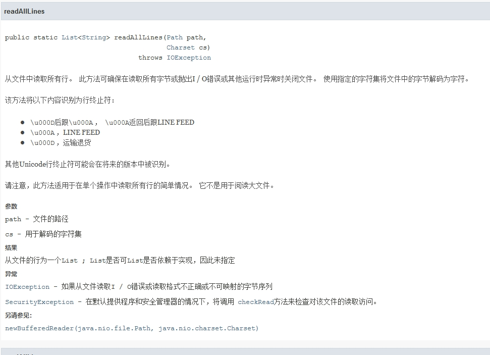

```java
Bufferedreader br = new BufferedReader(new InputStreamReader(System.in));
```

---

- List list = new ArrayList()  List list = new LinkedList() 而不是 ArrayList aList = new ArrayList() | LinkedList LList = new LinkedList() 的原因

1. ArrayList 和 LinkedList 都实现了 List 接口，即 ArrayList 和 LinkedList 都有 List 里定义的方法，实现的效果和返回值基本一致，只是数据结构不同(编程接口: 限制实现)
2. 当确定一种结构时你当然可以选择哪一种实现

- interface 和 abstract class 的选择
interface 会抽象化(模糊) 属性, 如动物包括物种(属性)和吃(方法)
当你只需要一种能吃的动物时选接口,当你需要一种能吃的猪时选抽象类

- 一般而言，Java 对象在虚拟机的结构如下：

1. 对象头（object header）：8 个字节
1. Java 原始类型数据：如 int, float, char 等类型的数据
1. 引用（reference）：4 个字节
1. 填充符（padding）

那么因该如何计算该 String 所占的空间？

```text
首先计算一个空的 char 数组所占空间，在 Java 里数组也是对象，因而数组也有对象头，故一个数组所占的空间为对象头所占的空间加上数组长度，即 8 + 4 = 12 字节 , 经过填充后为 16 字节。
那么一个空 String 所占空间为：
对象头（8 字节）+ char 数组（16 字节）+ 3 个 int（3 × 4 = 12 字节）+1 个 char 数组的引用 (4 字节 ) = 40 字节。
因此一个实际的 String 所占空间的计算公式如下：
8*( ( 8+2*n+4+12)+7 ) / 8 = 8*(int) ( ( ( (n) *2 )+43) /8 )
```

- 用户自己构建缓存，这种方式的优点是更加灵活。创建 HashMap，将需缓存的 String 作为 key 和 value 存放入 HashMap。假设我们准备创建的字符串为 key，将 Map cacheMap 作为缓冲池，那么返回 key 的代码如下：

```java
private String getCacheWord(String key) {
    String tmp = cacheMap.get(key);
    if(tmp != null) {
           return tmp;
    } else {
            cacheMap.put(key, key);
            return key;
    }
}
```

#### JDBC

`Connection conn = DriverManager.getConnection("jdbc:oracle:thin:@127.0.0.1:1521:orcl", "scott","tiger");`比 Class.forname() 新

- Stattement 可以 sql 注入
- PreparedStattement 预编译 支持占位符 防止注入(不识别关系运算符 '=' 'or' 'and' 等) 批量执行 是 Stattment 的子接口

- 事务的回滚,在多条更新的处理中一定要开启事务管理

```java
// 开启事务(手动提交)
conn.setAutoCommit(false);

// 提交事务
conn.commit();

// 事务回滚,在 catch 中
conn.rollback();
```

预编译的不能写 ';'

接口和抽象类不可以实例化,但可以实例化一个匿名类

- 类名右键可以抽取接口

```java
Calendar calendar = Calendar.getInstance();
calendar.set(1999,8,8);
Date date = new java.sql.Date(calendar.getTimeInMillis());
```

- 加载配置文件

```java
static  {
    Properties p = new Properties();
    try {
        p.load(new FileInputStream(news File(
            "parameter_files\\db.properties"
        )));
        url = p.getProperty("URL");
        username = p.getProperty("USERNAME");
        password = p.getProperty("PASSWORD");
    } catch (Exception e) {
        e.printStackTrace();
    }
}
```

### TODO

- 事务在业务层
- Integer 能传空值
- 装饰器模式注重同类之间的附加功能, 工程模式注重不同类之间的交接
- static 变量和普通变量的区别在于该变量是否属于同一个对象和属于同一个类的区别
- String contains("") 包含
- Dao 层基本的数据库原子操作, Service 层业务逻辑,完成一个基本需求, View 层尽量少的操作数据库, Controller 决定 View 的跳转
- 事务操作在业务层
- String MAX 为 Int.MAX_VALUE


// Integer 没有空构造方法
// "".equals(new String()) == true

- 乐观锁

> 乐观锁（ Optimistic Locking）其实是一种思想。相对悲观锁而言，乐观锁假设认为数据一般情况下不会造成冲突，所以在数据进行提交更新的时候，才会正式对数据的冲突与否进行检测，如果发现冲突了，则让返回用户错误的信息，让用户决定如何去做

- [值传递和引用传递](https://juejin.im/post/5bce68226fb9a05ce46a0476)

> 要看方法的参数是基本类型还是引用类型, java 中不存在真正的引用传递, 这是重新指向了一个新的地址
>> 如果是对基本数据类型的数据进行操作，由于原始内容和副本都是存储实际值，并且是在不同的栈区，因此形参的操作，不影响原始内容。
如果是对引用类型的数据进行操作，分两种情况，一种是形参和实参保持指向同一个对象地址，则形参的操作，会影响实参指向的对象的内容。一种是形参被改动指向新的对象地址（如重新赋值引用），则形参的操作，不会影响实参指向的对象的内容